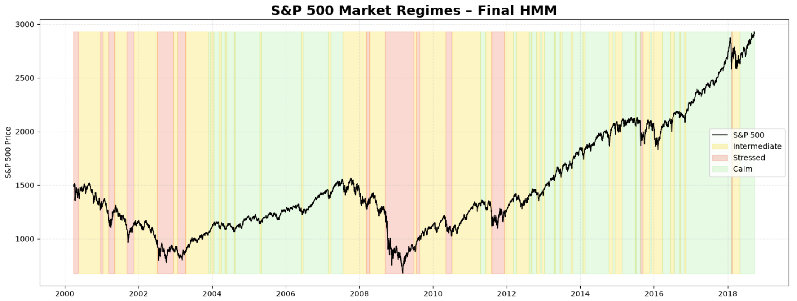
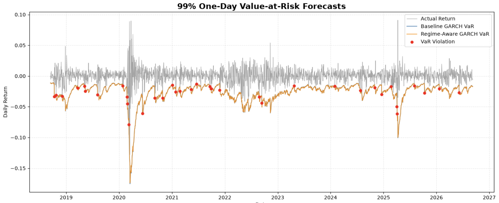

# Regime-Aware Value-at-Risk Forecasting

An empirical study of whether market regime information from a Hidden Markov Model can improve GARCH-based volatility and Value-at-Risk forecasts.

The project implements a custom Hidden Markov Model, GARCH volatility modelling, leakage-free walking-forward forecasting, and statistical VaR backtesting in Python.

## Overview

Financial market volatility changes significantly over time, particularly between calm and stressed market periods. Standard GARCH models models time-varying volatility but do not model different market regimes.

This project investigates if regime information from a Hidden Markov Model (HMM) can improve one-day-ahead volatility and Value-at-Risk (VaR) forecasts compared with a standard GARCH benchmark.

The modelling pipeline is:

```text
Market Data
    ↓
Feature Engineering
    ↓
GARCH(1,1)-t
    ↓
Hidden Markov Model
    ↓
Market Regime Detection
    ↓
Walking-Forward Volatility Forecasting
    ↓
Regime-Aware GARCH Adjustment
    ↓
99% Student-t VaR
    ↓
Out-of-Sample Backtesting
```

## Methodology

### GARCH Volatility Model

A GARCH(1,1) model with Student-t distribution is used as the baseline volatility model:


$\sigma_t^2 = \omega + \alpha \epsilon_{t-1}^2 + \beta \sigma_{t-1}^2$

Student-t is used to better capture the heavy tails commonly observed in financial returns. The model is evaluated using one-day-ahead forecasts in a walking-forward setting. GARCH parameters are re-estimated monthly and the conditional variance is updated daily as new returns become available.

### Hidden Markov Model

A three-state Gaussian Hidden Markov Model is used to identify latent market regimes.

The final HMM uses:

- 20-day momentum
- GARCH conditional volatility
- VIX

The model identifies three economically distinct regimes:

- **Calm** — low volatility and positive average trend
- **Intermediate** — moderate volatility
- **Stressed** — high volatility and negative average trend



The HMM implementation was built from scratch in Python, including forward filtering, backward filtering, Baum-Welch, and viterbi.

For out-of-sample forecasting only filtered probabilities are used to avoid introducing future information.

### Regime-Aware Volatility Forecast

The HMM transition matrix is used to calculate one-day-ahead regime probabilities:

$P(S_{t+1}\mid X_{1:t}) =P(S_t\mid X_{1:t})A$

These probabilities are converted into an expected regime volatility.

The baseline GARCH forecast is then adjusted according to the expected change in regime risk:


$$\sigma^{RA}_{t+1|t} = \sigma^{GARCH}_{t+1|t} \frac{\sigma^{HMM}_{t+1|t}}{\sigma^{HMM}_{t|t}}$$

This allows the HMM to increase or decrease the GARCH forecast when the market is expected to move toward a higher- or lower-volatility regime.

The approach is intentionally different from a full Markov-Switching GARCH model: the HMM and GARCH models are estimated separately, and regime information is used as an adjustment to the standard GARCH forecast.

## Out-of-Sample Evaluation

The models are evaluated using a chronological train/test split and walking-forward forecasting.

The forecasting pipeline is designed to prevent look-ahead bias:

- GARCH training features are estimated using training data only
- Feature scaling is fitted using training data only
- The HMM is estimated on the initial training period
- Filtered instead of smoothed HMM probabilities are used out-of-sample
- GARCH forecasts are produced before the corresponding realized return is observed
- Model parameters are updated using only information available at each forecast origin

This produces two competing one-day-ahead volatility forecasts:

1. **Baseline GARCH**
2. **Regime-Aware GARCH**

## Value-at-Risk

Both volatility forecasts are converted into 99% one-day Value-at-Risk forecasts.

Since the GARCH model uses Student-t distribution VaR is calculated using the standardized Student-t distribution:

$$VaR_{t+1|t}^{99\%} = \mu_t + \sigma_{t+1|t} q_{0.01,v_t}$$

where $q_{0.01,v_t}$ is the lower 1% quantile of the standardized Student-t distribution.

A VaR violation occurs when:

$r_{t+1} < VaR_{t+1|t}$

## Results



The final out-of-sample VaR backtest contains **2,006 observations**.

| Metric | Baseline GARCH | Regime-Aware GARCH |
|---|---:|---:|
| VaR confidence level | 99% | 99% |
| Observations | 2,006 | 2,006 |
| VaR violations | 36 | 36 |
| Violation rate | 1.79% | 1.79% |
| Kupiec p-value | 0.0013 | 0.0013 |
| Christoffersen independence p-value | 0.6778 | 0.6778 |

Both models produce the same 36 VaR violations, occurring on the same days.

The **Kupiec test rejects** the expected 1% violation rate, indicating that both models underestimate the frequency of extreme negative returns during the test period.

The **Christoffersen independence test does not reject** the hypothesis that violations are independent, providing no evidence of significant violation clustering.

### Key Finding

The HMM successfully identifies economically distinct market regimes, but the regime-aware adjustment does **not improve out-of-sample VaR performance** relative to the standard GARCH benchmark.

The estimated regimes are highly persistent, causing predicted next-day regime risk to remain close to current regime risk. As a result, the regime adjustment factor remains close to one and only makes small changes to the baseline GARCH forecasts.

This result highlights that identifying meaningful market regimes and does not necessarily lead to improvements when predicting value for risk forecasting.

## Project Structure

```text
regime-switching-var/
│
├── notebooks/
│   ├── 01_Exploratory_Data_Analysis.ipynb
│   ├── 02_GARCH_Volatility_Modelling.ipynb
│   ├── 03_Hidden_Markov_Models.ipynb
│   ├── 04_Regime_Switching_GARCH.ipynb
│   └── 05_Value_At_Risk_Backtest.ipynb
│
├── src/
│   ├── data_loader.py
│   ├── preprocessing.py
│   ├── features.py
│   ├── garch.py
│   └── markov_model/
│       └── hmm.py
|       └── forward.py
|       └── backward.py
|       └── baum_welch.py
|       └── viterbi.py
│
├── data/
│   └── processed/
│       └── volatility_forecasts.csv
│
├── requirements.txt
└── README.md
```

## Notebook Overview

### 01 — Exploratory Data Analysis

Explores market returns, volatility, distributions, and the features later used by the regime model.

### 02 — GARCH Volatility Modelling

Develops and evaluates the GARCH(1,1) volatility model, including Student-t innovations and residual diagnostics.

### 03 — Hidden Markov Models

Implements and evaluates a custom Gaussian HMM and uses it to identify calm, intermediate, and stressed market regimes.

The custom implementation is also compared with `hmmlearn` as an implementation benchmark.

### 04 — Regime-Aware GARCH

Combines the GARCH volatility forecasts with filtered HMM regime probabilities in a leakage-free walking-forward forecasting framework.

### 05 — Value-at-Risk Backtesting

Converts the volatility forecasts into 99% Student-t VaR forecasts and evaluates them using violation rates, the Kupiec unconditional coverage test, and the Christoffersen independence test.

## Technical Implementation

The project is implemented primarily in Python using:

- NumPy
- pandas
- SciPy
- Matplotlib
- scikit-learn
- `arch`
- `hmmlearn`

Several core components are implemented manually, including the Hidden Markov Model algorithms and VaR backtesting procedures.

## Limitations and Future Work

The regime-aware model used here is not a full Markov-Switching GARCH model. The HMM and GARCH models are estimated separately, and the HMM is used to adjust an existing GARCH volatility forecast.

A natural extension would be a jointly estimated **Markov-Switching GARCH model**, where volatility parameters such as persistence and sensitivity to shocks can vary directly between latent market regimes.

Other possible extensions include:

- Testing different VaR confidence levels
- Evaluating other financial markets
- Comparing alternative regime specifications
- Comparing against additional VaR benchmarks
- Extending the framework to Expected Shortfall
